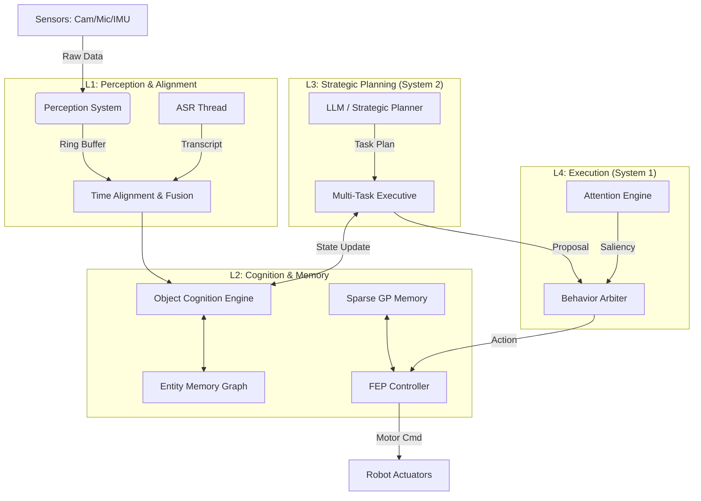

# Titan-AGI: Edge-Side Embodied Cognitive Intelligence Framework

[](https://isocpp.org/)
[](https://www.google.com/search?q=)
[](https://www.google.com/search?q=)

**Titan-AGI** 是一个专为端侧设备（如嵌入式机器人、边缘计算单元）设计的高性能具身智能（Embodied AI）框架。

不同于传统的“感知-规划-控制”流水线，Titan-AGI 基于 **双过程认知理论 (Dual-Process Theory)** 和 **自由能原理 (Free Energy Principle)** 构建。它不仅具备毫秒级的运动反应能力，还拥有基于 LLM 的长期推理、多任务编排和情景记忆能力。

-----

## 🌟 Core Features (核心特性)

### 1\. 🧠 双过程认知架构 (System 1 & System 2)

  * **System 1 (快系统):** 基于 C++ 硬实时逻辑、YOLO 和 FEP 控制器。负责毫秒级的反射、避障和习惯性动作。
  * **System 2 (慢系统):** 集成 LLM/VLM 和 战略规划器。负责复杂任务拆解、跨任务优化和长程推理。

### 2\. 👁️ 主动视觉与预测编码 (Active Vision & Predictive Coding)

  * **混合注意力机制:** 融合自下而上（显著性、惊奇度）和自上而下（任务目标）的注意力流。
  * **预测编码:** 每一层都生成感知的“预期”。当预期与现实不符时，产生预测误差（Surprise），驱动学习或注意力转移。

### 3\. 🦾 亚毫秒级时空对齐 (Sub-ms Synchronization)

  * **多轨道环形缓冲 (Multi-Track Ring Buffer):** 异步存储视觉、听觉和本体数据。
  * **高精度插值:** 使用 SLERP (球面线性插值) 和时间外推算法，解决视觉延迟（Latency）导致的手眼不协调问题，实现高速动态抓取。

### 4\. 📚 稀疏高斯过程记忆 (Sparse GP Muscle Memory)

  * **运动记忆:** 使用稀疏高斯过程 (Sparse Gaussian Process) 学习物理特性（如摩擦力、重量）。
  * **在线进化:** 具备遗忘机制和关键经验筛选，保证推理速度始终为 $O(1)$，支持终身学习。

### 5\. 📖 叙事性实体记忆 (Narrative Entity Memory)

  * **客体认知:** 从“检测框”进化为“世界实体 (World Entity)”，具备 Object Permanence。
  * **情景记忆:** 记录 "Who did What to Whom When"，支持基于 RAG 的语义检索和共情策略生成。

### 6\. ⚡ 多任务动态调度 (Dynamic Multi-Tasking)

  * **微观调度:** 基于动态评分（距离、资源、紧迫度）在每一帧进行软上下文切换。
  * **宏观规划:** 利用 LLM 进行跨任务优化（如路径合并），处理复杂的任务依赖。

-----

## 🏗️ System Architecture (系统架构)

Titan-AGI 采用模块化分层设计，确保高性能与可扩展性：



-----

## 📂 Directory Structure (工程目录)

```text
Titan-AGI/
├── CMakeLists.txt           # 构建脚本 (支持 Ninja/CCache/LTO)
├── include/titan/           # 头文件 (接口定义)
│   ├── core/                # 基础类型, 数学库, 环形缓冲
│   ├── memory/              # 稀疏GP记忆, 实体情景记忆
│   ├── perception/          # 感知系统, ASR集成, 注意力引擎
│   ├── cognition/           # 客体认知, 世界模型
│   ├── control/             # FEP 主动推理控制器
│   └── agent/               # TitanAgent, 多任务管家, 行为仲裁
└── src/                     # 源代码 (具体实现)
    ├── memory/              # SparseGP, EntityMemory 实现
    ├── perception/          # 传感器对齐, 视觉处理实现
    ├── cognition/           # Object Tracking 实现
    ├── control/             # 自由能最小化算法实现
    ├── agent/               # 核心 Tick 循环, 任务调度实现
    └── main.cpp             # 程序入口 & 模拟器
```

-----

## 🚀 Getting Started (快速开始)

### Prerequisites (依赖环境)

  * **Compiler:** GCC 9+ or Clang 10+ (C++17 Support)
  * **Build System:** CMake 3.15+
  * **Math Library:** Eigen3 (3.3+)
  * **Computer Vision:** OpenCV 4.x
  * **Optional:** Ninja (for faster builds), CCache

### Installation (安装步骤)

1.  **Clone the repository:**

    ```bash
    git clone https://github.com/your-username/titan-agi.git
    cd titan-agi
    ```

2.  **Create build directory:**

    ```bash
    mkdir build && cd build
    ```

3.  **Configure & Build:**

    ```bash
    # Release mode is recommended for performance
    cmake -DCMAKE_BUILD_TYPE=Release -GNinja ..
    ninja
    ```

4.  **Run the Simulation:**

    ```bash
    ./titan_main
    ```

-----

## 💡 Usage Example (核心逻辑概览)

在 `main.cpp` 中，你可以看到 Agent 的典型生命周期：

```cpp
// 初始化 Agent
titan::agent::TitanAgent robot;

// 1. 模拟用户输入 (System 2 介入)
robot.onUserCommand("Clean the kitchen and find my red cup");

// 2. 主控制循环 (100Hz)
while (running) {
    // 注入传感器数据 (支持异步/延迟模拟)
    robot.feedSensors(current_robot_state, camera_image, capture_time);
    
    // 执行一帧思考与行动
    robot.tick(); 
    
    // 内部发生了什么:
    // 1. Perception 对齐时间，生成 FusedContext
    // 2. ObjectCognition 更新世界实体 (ID Tracking)
    // 3. MultiTaskExecutive 评估优先级，生成 ActionProposal
    // 4. AttentionEngine 计算显著性 (预测误差 + 任务目标)
    // 5. BehaviorArbiter 仲裁最佳行为
    // 6. FEPController 计算力矩指令
}
```

-----

## 🛠️ Engineering Highlights (工程亮点)

  * **PImpl Idiom:** `TitanAgent` 使用 PImpl 模式隐藏实现细节，确保 API 接口极其整洁，并大幅减少编译依赖。
  * **Thread Safety:** 核心数据结构 `RingTrack` 采用互斥锁保护，支持感知线程写入与控制线程读取的并发操作。
  * **Zero-Copy Design:** 在关键路径（如任务生成）使用移动语义 (`std::move`) 和原地构造 (`emplace_back`)，避免不必要的内存分配。
  * **Data Persistence:** 支持将稀疏记忆和实体图谱序列化到磁盘，实现机器人重启后的知识保留。

-----

## 🔮 Roadmap (未来规划)

  * [ ] **Hardware Integration:** 适配 ROS2 接口，部署至实机 (Realman/Jaka Arms)。
  * [ ] **LLM Integration:** 接入本地量化 LLM (Llama-3-8B-Quantized) 替代 Mock 接口。
  * [ ] **VLM Capability:** 集成 Open-Vocabulary Segmentation (如 YOLO-World + SAM)。
  * [ ] **SLAM Fusion:** 将客体位置与 3D 语义地图 (Semantic OctoMap) 融合。

-----

## 📄 License

This project is licensed under the MIT License - see the [LICENSE](https://www.google.com/search?q=LICENSE) file for details.

-----

**Titan-AGI** is maintained by the Embodied AI Team.
*Pushing the boundaries of edge-side cognitive intelligence.*
